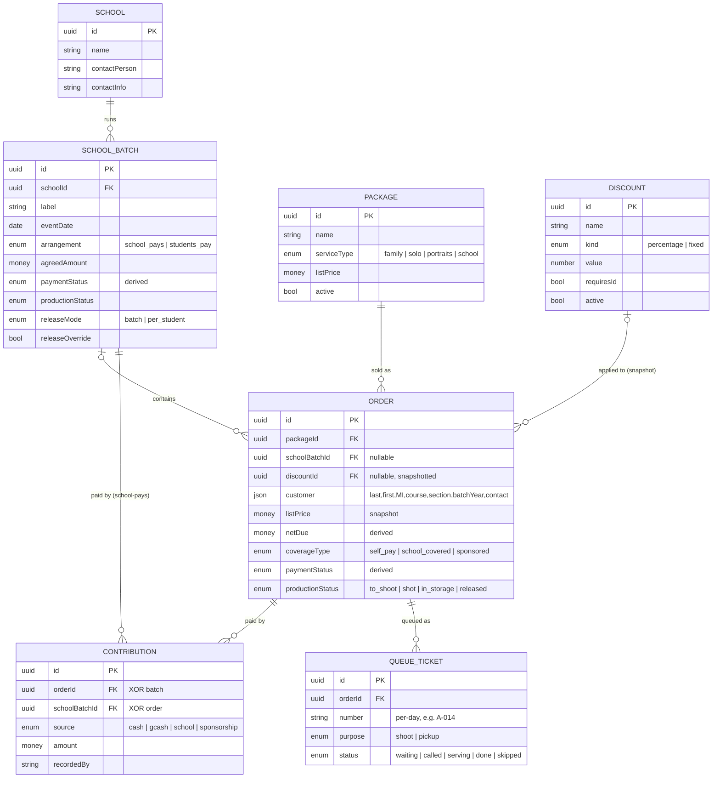

# JJ — Entity Relationship Diagram (Photography Module)

> Companion to `DATA-MODEL.md`. Renders as a diagram on GitHub.
> Crow's-foot notation: `||` = exactly one, `|o` = zero or one, `o{` = zero or many.

## Relationships in words

- A **School** runs many **School Batches**.
- A **School Batch** contains many **Orders** (an Order may belong to zero or one batch — walk-ins have none).
- A **Package** is sold as many **Orders**; each Order has exactly one Package.
- A **Discount** may apply to many **Orders**; each Order has zero or one discount (snapshotted onto the Order).
- An **Order** is paid by many **Contributions**; a **School Batch** also holds Contributions (for `school_pays`).
- A **Contribution** belongs to **exactly one** of Order *or* School Batch (XOR — not both). Mermaid can't draw the XOR, hence the note.
- An **Order** is queued as many **Queue Tickets** (one `shoot` now; a future `pickup` ticket is why this is one-to-many, not one-to-one).

## Notes

- **Settings entities** (`PACKAGE`, `DISCOUNT`) are configured by staff; everything
  else is operational data created during a day.
- **Derived fields** (`netDue`, `paymentStatus`, batch `paymentStatus`) are computed,
  not stored as source of truth — see `DATA-MODEL.md` §6.
- The diagram shows key attributes only; full field lists live in `DATA-MODEL.md`.
